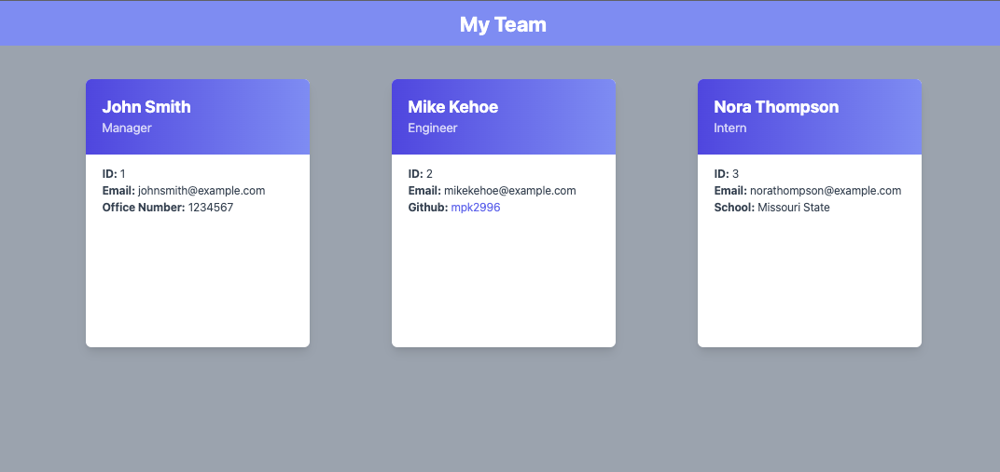

# Team Profile Generator - Module 10 Challenge

## Description

This is a command line node application that allows the user to generate a team profile through the command line by simply answering questions. The user can build a team with a Manager, Engineer , or intern. The user can succesfully generate a HTML team page with cards that include information of each individual team member using this application.

## Table of Contents

- [Installation](#installation)
- [Usage](#usage)
- [Credits](#credits)
- [License](#license)

## Installation

Clone this repository to your local machine using the command `git clone`

https://github.com/mpk2996/team-profile-generator.git

Open the repository in your terminal and run `npm install` to install the required dependencies

## Usage

At the root directory of the application, enter the command node index.js. Complete the command line prompts in order to create your team of managers, engineers and interns. Once you have completed the prompts, an index.html file will be generated with your responses.

Link to video demo of application:

## Credits

Node.js
https://nodejs.org/en/

Tailwind CSS 
https://tailwindcss.com/

This application was created by Mike Kehoe.

## License

Please refer to the LICENSE in the repo.

---